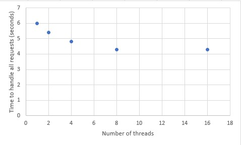

# Discount service

This is a microservice reachable by a rest api. Its api is documented in api/discount.yaml

# SetUp instructions

There are two setups that can be done for the project

## Production ready setup (with docker)
There are three requisites:
 - git must be installed with version 2.7.4
 - docker must be installed with version 1.13.1
 - docker-compose must be installed with version 1.11.1

To start the application
```bash
curl -o discount.sh https://raw.githubusercontent.com/jsotogaviard/discount/master/discount.sh
./discount.sh
```

You can check the service is up by calling:
```bash
curl http://localhost:8000/api/v1/checkout
```

## Dev setup

The dev setup ca be done as follows

 - git clone the project
 ```bash
git clone https://github.com/jsotogaviard/discount
 ```
 
 - Install go-swagger and generate client, server and model classes 
 ```bash
 go get -u github.com/go-swagger/go-swagger/cmd/swagger
 swagger generate server -f ./api/discount.yaml
 swagger generate client -f ./api/discount.yaml
 ```
 
- Install dep and dependencies of the project 
 ```bash
 go get -u github.com/golang/dep/cmd/dep
 dep ensure
```

- You can start the server in discount/cmd/checkout-server/main.go

- You can run the tests
 ```bash
 go test github.com/jsotogaviard/discount
```

# Explanation

There are several choices I have made to create this micro service

## OpenApi

I have used go-swagger to generate the client, server and models from a a swagger file
This file can be found in ./api/discount.yaml. 

You can find the client in discount/client
You can find the server in discount/server
You can find the model in discount/models

You can copy/paste api/discount.yaml in http://editor.swagger.io to have a documentation of the api

## Share memory by communicating

In order to take into account : "that our clients can access the service from several devices simultaneously."
The state (holding the cart id and the scanned items) must be thread safe. I use the following go pattern:
https://blog.golang.org/share-memory-by-communicating
  
## Concurrent handling of requests

Parallelism is an environment variable that allows to you to define how many threads in parallel will be handling the requests.
I use the concept of thread confinement: each cart id will be handled by only one thread. This ensures the thread safety of the state

There is another variable called delay. Delay is a number, in milliseconds, that allows you to simulate a task that takes some time to execute.

Using the check_client_test, for five concurrent users and each user doing ten requests with a delay of 100 milliseconds we obtain:


We see that adding threads we divide the performances by five.

For fifty concurrent users and each user doing hundred requests with no delay, we can see the following:



In this case there is some performance gain but not as important as in the other case. 

**`This service is able to handle 4500 requests per second`**  

## Integration tests
There are four integration tests related to each of the possible operations:
- Create a new cart 
- Scan a product
- Get the total amount
- Remove the cart

## Dep
Dependency management is handled by dep